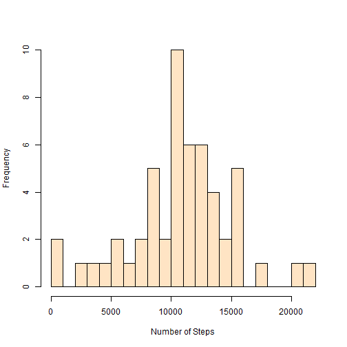
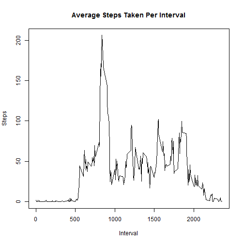
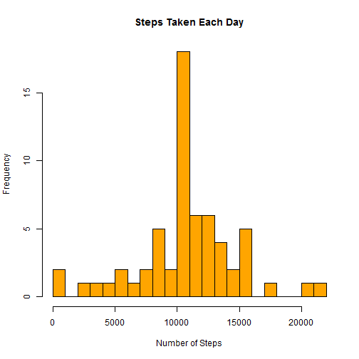
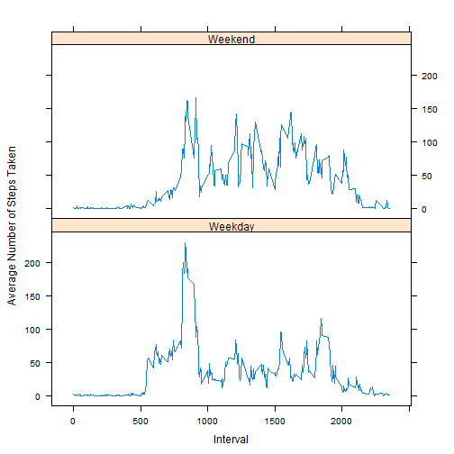

Reproducible Research: Peer Assessment #1
==========================================
####Bob Rager --- Coursera / Johns Hopkins University --- February 2015

## Loading and preprocessing the data

* Show any code needed to load the data or transofrm it into a suitable format

First the data must be unzipped and read into R. Download the activity.zip file into your working directory before knitting this Rmd file into HTML.


```r
#Unzip and read the data into R
unzip("activity.zip")
data <- read.csv("activity.csv", sep=",", header=T)
```

## What is mean total number of steps taken per day?

* Calculate the total steps taken per day
* Make a histogram of the total number of steps taken per day
* Calculate and report the mean and median of the total number of steps taken per day


```r
# Create a new data frame with the total number of steps taken per day
dailySteps <- aggregate(steps ~ date, data, sum)
```

**Below is a histogram of the total number of steps taken per day.**


```r
hist(dailySteps$steps, breaks=20, col="bisque", ylab="Frequency", xlab="Number of Steps", main="")
```

 


```r
# Find the mean and median of the total number of steps taken per day
meanData <- mean(dailySteps$steps)
medianData <- median(dailySteps$steps)
```

**The mean of the total number of steps taken per day is 1.0766189 &times; 10<sup>4</sup>.**

**The median of the total number of steps taken per day is 10765.**

## What is the average daily activity pattern?

* Make a time series plot of 5-minute interval (x-axis) and avg steps taken (y-axis)
* Which 5-minute interval contains the maximum number of steps?

**Below is a line plot of the average number of steps taken at each interval.**


```r
# Create a data frame with interval and average (mean) number of steps per interval
intervalMean <- aggregate(steps ~ interval, data, mean)
plot(intervalMean, type="l", ylab="Steps", xlab="Interval", main="Average Steps Taken Per Interval")
```

 


```r
# Find the interval at which the number of steps is at a maximum for the steps variable
intervalMax <- intervalMean$interval[which.max(intervalMean$steps)]
```

**The 5-minute interval with the maximum number of steps is 835.**

## Imputing missing values

* Calculate and report the total number of missing values in the dataset
* Devise a strategy to fill in missing values in the dataset
* Create a new dataset with the missing data filled in
* Make a histogram of the total steps taken each day
* Calculate and report the mean and median total number of steps taken per day
* What is the impact of imputing missing data on the estimates of the total daily number of steps?


```r
# Find the total number of rows with NA values
naTotal <- sum(is.na(data))
```

**The total number of rows in the dataset with missing values is 2304.**

**Missing data was imputed by replacing each NA with the average steps taken across all days for that interval. For details, see the comments.**


```r
# NA values from the dataset will be filled in with interval mean data pulled from the previous 
# question. For each NA, the interval will be identified, and the corresponding interval mean
# value will replace the NA in the dataset.
data2 <- transform(data, steps=ifelse(is.na(data$steps), intervalMean$steps[match(data$interval, intervalMean$interval)], data$steps))
```

**Below is a histogram, made from the new dataset, of the total number of steps taken per day.**


```r
dailySteps2 <- aggregate(steps ~ date, data2, sum)
hist(dailySteps2$steps, breaks=20, col="orange", ylab="Frequency", xlab="Number of Steps", main="Steps Taken Each Day")
```

 

```r
meanData2 <- mean(dailySteps2$steps)
medianData2 <- median(dailySteps2$steps)
```

**The mean of the total number of steps taken per day is 1.0766189 &times; 10<sup>4</sup>.**

**The median of the total number of steps taken per day is 1.0766189 &times; 10<sup>4</sup>.**

**Comparison between original and imputed data:**

Median and mean values from original and imputed datasets are roughly the same, but the sum of all steps taken differs greatly between datasets.


```r
originalSum <- as.integer(sum(data$steps, na.rm=T))
newSum <- as.integer(sum(data2$steps, na.rm=T))
difference <- abs(originalSum - newSum)
perDiff <- as.integer((difference/originalSum)*100)
```

The original dataset shows a sum total of 570608 steps taken. The new dataset shows a total of 656737 steps taken. The imputed dataset shows a total of 86129 more steps across all data points. That means that the imputed dataset has 15% more steps than the original data.

## Are there differences in activity patterns between weekdays and weekends?

* Use the dataset with the filled-in missing values for this part
* Create a new factor variable in the dataset with two levels: weekday and weekend
* Make a panel plot containing a time series plot of the 5-minute interval (x-axis) and average number of steps taken (y-axis) - see the GitHub repository for the original assignment to see an example of what this lot should look like


```r
# Create a vector of weekdays. Create a new variable in the imputed dataset with "Weekday" or
# "Weekend" based on the weekday. Create a third dataset that groups the steps data points by
# average steps per interval per weekPart.
weekdays <- c("Monday", "Tuesday", "Wednesday", "Thursday", "Friday")
data2$weekPart <- as.factor(ifelse(is.element(weekdays(as.Date(data2$date)),weekdays), "Weekday", "Weekend"))
data3 <- aggregate(steps ~ interval + weekPart, data2, mean)
```

**Below is a panel plot of 5-minute interval vs. average number of total steps taken across all days, separated by week part (Weekend or Weekday).**


```r
library(lattice)
xyplot(data3$steps ~ data3$interval | data3$weekPart, xlab="Interval", ylab="Average Number of Steps Taken", layout=c(1,2), type="l")
```

 
